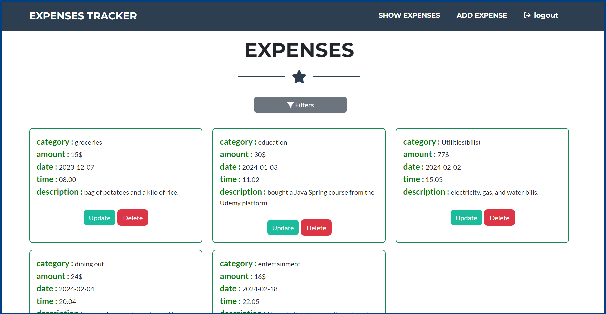
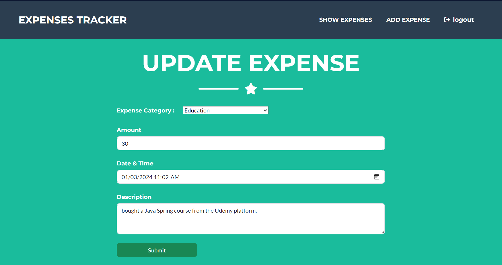

# Expenses Tracker WebApp

## Overview

The Expenses Tracker App is a financial management application developed using **Java, Spring Boot, Spring Security, Spring Data JPA, Thymeleaf, Bootstrap, and MySQL**.

The application provides user authentication and authorization, allowing users to securely sign up, sign in, and manage their expenses through CRUD operations. Users can also filter their expenses to efficiently organize and analyze their financial data.

The application is containerized using **Docker and Docker Compose**, with separate containers for the Spring Boot application, MySQL database, and Nginx reverse proxy.

## Technologies Used

* Java 17
* Spring Boot
* Spring MVC
* Spring Security
* Spring Data JPA
* MySQL
* Thymeleaf
* Bootstrap
* Maven
* Docker
* Docker Compose
* Nginx

## Features

* **User Authentication and Authorization:** Securely sign up, sign in, and access the application using Spring Security.
* **CRUD Operations:** Add, view, update, and delete expenses.
* **Filtering:** Filter and organize expenses based on available criteria.
* **MySQL Database:** Store application data in a MySQL database.
* **Dockerized Application:** Run the Spring Boot application, MySQL database, and Nginx using Docker Compose.
* **Persistent Database Storage:** MySQL data is stored using a persistent bind mount.
* **Nginx Reverse Proxy:** Nginx forwards incoming HTTP requests to the Spring Boot application.

---

# Docker

The application uses a **multi-stage Docker build**.

The Dockerfile contains two stages:

1. **Stage 1 — Build the Spring Boot application**
2. **Stage 2 — Run the Spring Boot application**

Using multiple stages keeps Maven and other build tools out of the final runtime image.

## Dockerfile

```dockerfile
# ============================================================
# STAGE 1: BUILD THE SPRING BOOT APPLICATION
# ============================================================

# Use a Maven image that already contains:
# - Maven 3.9 → used to build the project
# - Eclipse Temurin → Java distribution
# - Java 17 → required by our project (pom.xml)
# "AS builder" gives this build stage the name "builder"
FROM maven:3.9-eclipse-temurin-17 AS builder

# Set /app as the working directory inside the container.
# All following commands in this stage will run from /app.
# If /app does not exist, Docker creates it automatically.
WORKDIR /app

# Copy the pom.xml file from our local project
# into the current working directory inside the container (/app).
# pom.xml contains Maven's project configuration,
# dependencies, plugins, and Java version information.
COPY pom.xml .

# Copy the src directory from our local project
# into /app/src inside the container.
# src contains our Java source code, resources, templates, etc.
COPY src ./src

# Run Maven to build/package the Spring Boot application.
#
# mvn        → execute Maven
# clean      → remove previous build files
# package    → compile the code and create the JAR file
# -DskipTests → skip running tests during the Docker build
#
# After this command, Maven creates the JAR inside:
# /app/target/*.jar
RUN mvn clean package -DskipTests


# ============================================================
# STAGE 2: RUN THE SPRING BOOT APPLICATION
# ============================================================

# Start a NEW image for running the application.
#
# eclipse-temurin → Java distribution
# 17             → Java version required by our project
# jre            → Java Runtime Environment; we only need
#                  Java to RUN the already-built JAR.
#
# Maven and the source code are not needed in this stage.
FROM eclipse-temurin:17-jre

# Set /app as the working directory inside the runtime container.
WORKDIR /app

# Copy the JAR created in STAGE 1 into STAGE 2.
#
# --from=builder
#   → copy the file from the Docker stage named "builder"
#
# /app/target/*.jar
#   → location of the JAR created by Maven in Stage 1
#   → *.jar means any JAR file in the target directory
#
# app.jar
#   → rename the copied JAR to a simple, predictable name
#      inside the runtime container
COPY --from=builder /app/target/*.jar app.jar

# Document that the Spring Boot application listens
# on port 8080 inside the container.
#
# 8080 comes from Spring Boot's default server port,
# unless it has been changed in application.properties/yml.
EXPOSE 8080

# Command that runs automatically when the container starts.
#
# java     → start Java
# -jar     → tell Java to execute a JAR file
# app.jar  → the JAR we copied from Stage 1
#
# This starts our Spring Boot application.
ENTRYPOINT ["java", "-jar", "app.jar"]
```

---

# Docker Compose

Docker Compose is used to run the complete application stack:

```text
                    🌐 Browser
                        │
                        │ HTTP :80
                        ▼
                ┌────────────────┐
                │      Nginx     │
                │ Reverse Proxy  │
                │      :80       │
                └───────┬────────┘
                        │
                        │ Docker Network
                        ▼
                ┌────────────────┐
                │  Spring Boot   │
                │      :8080     │
                └───────┬────────┘
                        │
                        │ Docker Network
                        ▼
                ┌────────────────┐
                │     MySQL      │
                │      :3306     │
                └────────────────┘
```

There are three runtime services:

1. **MySQL** → Database
2. **Spring Boot** → Backend application
3. **Nginx** → Reverse proxy

Maven is **not a separate Docker Compose service**. Maven is used in **Stage 1 of the Dockerfile** to build the Spring Boot JAR.

## Docker Compose Configuration

```yaml
services:

  # ============================================================
  # MYSQL DATABASE
  # ============================================================
  mysql:
    image: mysql:latest
    container_name: mysql_container

    ports:
      - "3306:3306"

    environment:
      MYSQL_ROOT_PASSWORD: Test@123
      MYSQL_DATABASE: expenses_tracker

    volumes:
      # Persist MySQL data using a bind mount
      - ./mysql-database:/var/lib/mysql

    networks:
      - expenses-app-network

    restart: unless-stopped

    healthcheck:
      test: ["CMD", "mysqladmin", "ping", "-h", "localhost", "-uroot", "-pTest@123"]
      interval: 10s
      timeout: 5s
      retries: 5
      start_period: 30s


  # ============================================================
  # SPRING BOOT APPLICATION
  # ============================================================
  java_app:
    build: .
    image: expenses-tracker
    container_name: ExpensesTrackerApp-container

    ports:
      - "8080:8080"

    environment:
      SPRING_DATASOURCE_URL: jdbc:mysql://mysql:3306/expenses_tracker
      SPRING_DATASOURCE_USERNAME: root
      SPRING_DATASOURCE_PASSWORD: Test@123

    networks:
      - expenses-app-network

    depends_on:
      mysql:
        condition: service_healthy

    restart: unless-stopped


  # ============================================================
  # NGINX REVERSE PROXY
  # ============================================================
  nginx:
    build:
      context: ./nginx

    image: expenses-tracker-nginx
    container_name: nginx-container

    ports:
      - "80:80"

    depends_on:
      java_app:
        condition: service_started

    networks:
      - expenses-app-network

    restart: unless-stopped


# ============================================================
# NETWORK
# ============================================================
networks:
  expenses-app-network:
```

---

# 🔐 Where to Find Database Username, Password and Database Name

When you need to check the database configuration used by the Spring Boot application, first check:

```text
src/main/resources/application.properties
```

Inside this file, look for:

```properties
spring.datasource.url=...
spring.datasource.username=...
spring.datasource.password=...
```

These properties tell you:

```text
Username → spring.datasource.username
Password → spring.datasource.password
Database → database name inside spring.datasource.url
```

For example:

```properties
spring.datasource.url=jdbc:mysql://localhost:3306/expenses_tracker
spring.datasource.username=root
spring.datasource.password=Test@123
```

From this configuration:

```text
Username : root
Password : Test@123
Database : expenses_tracker
Port     : 3306
```

## Docker Compose Configuration

For Docker, also check the `environment:` section inside:

```text
docker-compose.yml
```

Spring Boot:

```yaml
environment:
  SPRING_DATASOURCE_URL: jdbc:mysql://mysql:3306/expenses_tracker
  SPRING_DATASOURCE_USERNAME: root
  SPRING_DATASOURCE_PASSWORD: Test@123
```

MySQL:

```yaml
environment:
  MYSQL_ROOT_PASSWORD: Test@123
  MYSQL_DATABASE: expenses_tracker
```

So for this project:

```text
Spring Boot Username : root
Spring Boot Password : Test@123
MySQL Root Password  : Test@123
Database             : expenses_tracker
MySQL Port           : 3306
Spring Boot Port     : 8080
Nginx Port            : 80
```

> **Important:** `mysql` in `jdbc:mysql://mysql:3306/...` is the **Docker Compose service name**, not the container name.

---

# 🐬 How to Enter MySQL Database

First check the running containers:

```bash
docker ps
```

The MySQL container name comes from `docker-compose.yml`:

```yaml
container_name: mysql_container
```

Therefore, use:

```bash
docker exec -it mysql_container mysql -u root -p
```

MySQL will ask:

```text
Enter password:
```

Enter:

```text
Test@123
```

---

## ⚡ Direct Login with Password

You can also provide the password directly:

```bash
docker exec -it mysql_container mysql -u root -pTest@123
```

> **Important:** There is **no space** between `-p` and `Test@123`.

Correct:

```bash
docker exec -it mysql_container mysql -u root -pTest@123
```

Not:

```bash
docker exec -it mysql_container mysql -u root -p Test@123
```

---

# 🗄️ MySQL Commands

After entering MySQL:

### Show Databases

```sql
SHOW DATABASES;
```

You should see:

```text
expenses_tracker
```

### Select the Database

```sql
USE expenses_tracker;
```

### Show Tables

```sql
SHOW TABLES;
```

### Check Data

For example:

```sql
SELECT * FROM users;
```

or:

```sql
SELECT * FROM expenses;
```

Use the actual table names returned by:

```sql
SHOW TABLES;
```

### Exit MySQL

```sql
exit;
```

---

# 🐳 Enter MySQL Container Shell

You can also enter the MySQL container first:

```bash
docker exec -it mysql_container bash
```

Then:

```bash
mysql -u root -p
```

Enter:

```text
Test@123
```

Then:

```sql
SHOW DATABASES;
USE expenses_tracker;
SHOW TABLES;
```

Exit MySQL:

```sql
exit;
```

Then exit the container:

```bash
exit
```

---

# 📌 MySQL Quick Reference

```text
Service Name   : mysql
Container Name : mysql_container
Username       : root
Password       : Test@123
Database       : expenses_tracker
Port           : 3306
```

Direct login:

```bash
docker exec -it mysql_container mysql -u root -pTest@123
```

Login with password prompt:

```bash
docker exec -it mysql_container mysql -u root -p
```

Enter container:

```bash
docker exec -it mysql_container bash
```

---

# 🌐 Nginx Reverse Proxy

Nginx is used as a **reverse proxy** in front of the Spring Boot application.

The request flow is:

```text
Browser
   │
   │ http://localhost
   ▼
Nginx :80
   │
   │ Docker Network
   ▼
Spring Boot :8080
   │
   │ Docker Network
   ▼
MySQL :3306
```

The user accesses:

```text
http://localhost
```

Nginx receives the request on:

```text
Port 80
```

and forwards the request to the Spring Boot application on:

```text
java_app:8080
```

Because both containers are connected to:

```yaml
expenses-app-network
```

Nginx can communicate with Spring Boot using the Docker Compose service name:

```text
java_app
```

---

# 📁 Nginx Directory

The Nginx service is built from:

```yaml
nginx:
  build:
    context: ./nginx
```

Therefore, the project contains an Nginx directory:

```text
nginx/
```

The Nginx Docker configuration and reverse-proxy configuration are kept inside this directory.

---

# Understanding the JDBC URL

The Spring Boot application connects to MySQL using:

```text
jdbc:mysql://mysql:3306/expenses_tracker
```

The URL can be broken down as:

```text
jdbc:mysql://mysql:3306/expenses_tracker
│    │       │     │      │
│    │       │     │      └── Database name
│    │       │     └───────── MySQL port
│    │       └─────────────── MySQL service name
│    └─────────────────────── MySQL database type
└──────────────────────────── Java Database Connectivity
```

### `jdbc:mysql`

Indicates that Java is connecting to a **MySQL database using JDBC**.

### `mysql`

This is the **Docker Compose service name** of the MySQL service.

Docker's internal DNS allows the Spring Boot container to find the MySQL service using this name.

### `3306`

This is the default MySQL port.

### `expenses_tracker`

This is the MySQL database name.

---

# Important: Service Name vs Container Name

This is an important Docker Compose concept.

In our configuration:

```yaml
services:

  mysql:
    image: mysql:latest
    container_name: mysql_container
```

There are two different names:

```text
mysql
   ↓
Docker Compose service name

mysql_container
   ↓
Container name
```

For container-to-container communication, use the **service name**.

Therefore, Spring Boot uses:

```yaml
SPRING_DATASOURCE_URL: jdbc:mysql://mysql:3306/expenses_tracker
```

It uses:

```text
mysql
```

NOT:

```text
mysql_container
```

## Why?

Docker Compose provides internal DNS using the service name.

The communication is:

```text
Spring Boot
    │
    │ jdbc:mysql://mysql:3306/expenses_tracker
    ▼
mysql service
    │
    ▼
mysql_container
```

## Container Name Is Used by Docker Commands

When using:

```bash
docker exec
```

we use the actual container name:

```bash
docker exec -it mysql_container bash
```

or:

```bash
docker exec -it mysql_container mysql -u root -p
```

So remember:

```text
JDBC / Docker Network
        ↓
Use service name: mysql

docker exec
        ↓
Use container name: mysql_container
```

---

# Nginx vs Spring Boot vs MySQL Names

The same concept applies to all services.

```yaml
services:

  mysql:
    container_name: mysql_container

  java_app:
    container_name: ExpensesTrackerApp-container

  nginx:
    container_name: nginx-container
```

| Service     | Service Name | Container Name                 | Internal Port |
| ----------- | ------------ | ------------------------------ | ------------: |
| MySQL       | `mysql`      | `mysql_container`              |        `3306` |
| Spring Boot | `java_app`   | `ExpensesTrackerApp-container` |        `8080` |
| Nginx       | `nginx`      | `nginx-container`              |          `80` |

For Docker network communication:

```text
Spring Boot → mysql:3306
Nginx       → java_app:8080
```

For Docker commands:

```text
MySQL       → mysql_container
Spring Boot → ExpensesTrackerApp-container
Nginx       → nginx-container
```

---

# MySQL Database Persistence

The MySQL service uses a **bind mount**:

```yaml
volumes:
  - ./mysql-database:/var/lib/mysql
```

This maps the local directory:

```text
./mysql-database
```

to the MySQL data directory inside the container:

```text
/var/lib/mysql
```

Therefore:

```text
Local machine
     │
     │ ./mysql-database
     ▼
MySQL container
     │
     │ /var/lib/mysql
     ▼
MySQL database files
```

This allows the database data to persist when the MySQL container is recreated.

## Check MySQL Data Directory

The project uses a local bind mount:

```text
./mysql-database
```

So the database files are stored inside the project directory.

---

# `.dockerignore`

Because `mysql-database` is located inside the project directory, Docker may try to include the database files in the Docker build context.

To prevent this, create a `.dockerignore` file in the project root:

```text
mysql-database/
target/
.git/
.gitignore
```

This prevents unnecessary files from being sent to Docker during the build.

---

# Running the Application with Docker

## 1. Build the Docker Images

```bash
docker compose build
```

This builds:

```text
Spring Boot Image
        +
Nginx Image
```

MySQL uses the official:

```text
mysql:latest
```

image, so Docker pulls it if it is not already available locally.

## 2. Start the Containers

```bash
docker compose up -d
```

This starts:

```text
mysql_container
ExpensesTrackerApp-container
nginx-container
```

## 3. Check Running Containers

```bash
docker compose ps
```

or:

```bash
docker ps
```

## 4. View Spring Boot Logs

Using Compose service name:

```bash
docker compose logs java_app
```

To follow the logs:

```bash
docker compose logs -f java_app
```

## 5. View MySQL Logs

```bash
docker compose logs mysql
```

To follow the logs:

```bash
docker compose logs -f mysql
```

## 6. View Nginx Logs

```bash
docker compose logs nginx
```

To follow the logs:

```bash
docker compose logs -f nginx
```

## 7. Stop the Application

```bash
docker compose down
```

The MySQL data stored in:

```text
./mysql-database
```

remains because it is stored using a bind mount.

---

# Access the Application

Because Nginx is the reverse proxy, the normal application entry point is:

```text
http://localhost
```

Nginx listens on:

```text
80
```

Docker Compose maps:

```yaml
ports:
  - "80:80"
```

Therefore:

```text
Browser
   │
   ▼
localhost:80
   │
   ▼
Nginx
   │
   ▼
Spring Boot:8080
```

## AWS EC2

For an AWS EC2 deployment:

```text
http://<EC2-PUBLIC-IP>
```

Make sure the EC2 Security Group allows inbound TCP traffic on:

```text
80
```

You normally do **not** need to access Spring Boot directly from the browser because Nginx is handling the external request.

Spring Boot is still available through:

```text
http://<EC2-PUBLIC-IP>:8080
```

if port `8080` is exposed and allowed by the Security Group.

---

# Running Without Docker

## 1. Configure MySQL

Create the `expenses_tracker` database in MySQL and configure the database connection in:

```text
src/main/resources/application.properties
```

Check:

```properties
spring.datasource.url=...
spring.datasource.username=...
spring.datasource.password=...
```

## 2. Build the Application

```bash
mvn clean package
```

## 3. Run the JAR

```bash
java -jar target/<generated-jar-name>.jar
```

## 4. Access the Application

Open:

```text
http://localhost:8080
```

When running without Docker, Nginx is not required unless you configure it separately.

---

# Troubleshooting

## Spring Boot Cannot Connect to MySQL

First check the containers:

```bash
docker compose ps
```

Then check Spring Boot logs:

```bash
docker compose logs java_app
```

Check MySQL logs:

```bash
docker compose logs mysql
```

### Check the JDBC hostname

Our Compose service is:

```yaml
mysql:
```

Therefore, the JDBC URL should use:

```text
jdbc:mysql://mysql:3306/expenses_tracker
```

Do **not** use:

```text
jdbc:mysql://mysql_container:3306/expenses_tracker
```

because:

```text
mysql
   ↓
Service name

mysql_container
   ↓
Container name
```

For Docker network communication, use the service name.

---

# Check MySQL Health

The MySQL service has a healthcheck:

```yaml
healthcheck:
  test: ["CMD", "mysqladmin", "ping", "-h", "localhost", "-uroot", "-pTest@123"]
  interval: 10s
  timeout: 5s
  retries: 5
  start_period: 30s
```

The Spring Boot service uses:

```yaml
depends_on:
  mysql:
    condition: service_healthy
```

This makes Docker Compose wait for the MySQL service to become healthy before starting the Spring Boot application.

---

# Check Nginx

Check the Nginx container:

```bash
docker ps
```

Check Nginx logs:

```bash
docker compose logs nginx
```

Check the Nginx configuration/build:

```bash
docker compose build nginx
```

Restart Nginx:

```bash
docker compose restart nginx
```

If Nginx is running but the application is not accessible, check:

```bash
docker compose ps
```

Then check:

```bash
docker compose logs nginx
docker compose logs java_app
```

Remember that Nginx should communicate with Spring Boot using:

```text
java_app:8080
```

because `java_app` is the Docker Compose service name.

---

# Useful Docker Commands

### List Running Containers

```bash
docker ps
```

### List All Containers

```bash
docker ps -a
```

### List Docker Images

```bash
docker images
```

### Check Compose Services

```bash
docker compose ps
```

### Rebuild the Application

```bash
docker compose build --no-cache
```

### Recreate Containers

```bash
docker compose up -d --build
```

### Stop and Remove Containers

```bash
docker compose down
```

### View All Logs

```bash
docker compose logs
```

### Follow All Logs

```bash
docker compose logs -f
```

### Spring Boot Logs

```bash
docker compose logs -f java_app
```

### MySQL Logs

```bash
docker compose logs -f mysql
```

### Nginx Logs

```bash
docker compose logs -f nginx
```

### Enter MySQL

```bash
docker exec -it mysql_container mysql -u root -p
```

### Enter MySQL Container

```bash
docker exec -it mysql_container bash
```

### Enter Spring Boot Container

```bash
docker exec -it ExpensesTrackerApp-container bash
```

### Enter Nginx Container

```bash
docker exec -it nginx-container sh
```

### Stop and Remove Containers and Volumes

```bash
docker compose down -v
```

> **Warning:** Do not use `docker compose down -v` if you need to preserve Docker-managed volumes. For this project, the MySQL database uses a bind mount, so `./mysql-database` is outside the Docker volume system.

---

# Quick Architecture

```text
                         🌐 USER
                           │
                           │ HTTP :80
                           ▼
                  ┌──────────────────┐
                  │      NGINX       │
                  │ nginx-container  │
                  │       :80        │
                  └────────┬─────────┘
                           │
                           │ java_app:8080
                           ▼
                  ┌──────────────────┐
                  │   SPRING BOOT    │
                  │ ExpensesTracker  │
                  │     :8080        │
                  └────────┬─────────┘
                           │
                           │ mysql:3306
                           ▼
                  ┌──────────────────┐
                  │      MYSQL       │
                  │ mysql_container  │
                  │     :3306        │
                  └────────┬─────────┘
                           │
                           ▼
                  ./mysql-database
```

---

# 📌 Final Project Quick Reference

```text
Project
└── Expenses Tracker
      │
      ├── Spring Boot
      │     Service  : java_app
      │     Container: ExpensesTrackerApp-container
      │     Port     : 8080
      │
      ├── MySQL
      │     Service  : mysql
      │     Container: mysql_container
      │     Port     : 3306
      │     Database : expenses_tracker
      │     Username : root
      │     Password : Test@123
      │
      └── Nginx
            Service  : nginx
            Container: nginx-container
            Port     : 80
```

### Main Commands

Start:

```bash
docker compose up -d
```

Check:

```bash
docker compose ps
```

Open application:

```text
http://localhost
```

MySQL login:

```bash
docker exec -it mysql_container mysql -u root -p
```

MySQL direct login:

```bash
docker exec -it mysql_container mysql -u root -pTest@123
```

Stop:

```bash
docker compose down
```

Rebuild:

```bash
docker compose up -d --build
```

---

# Screenshots







